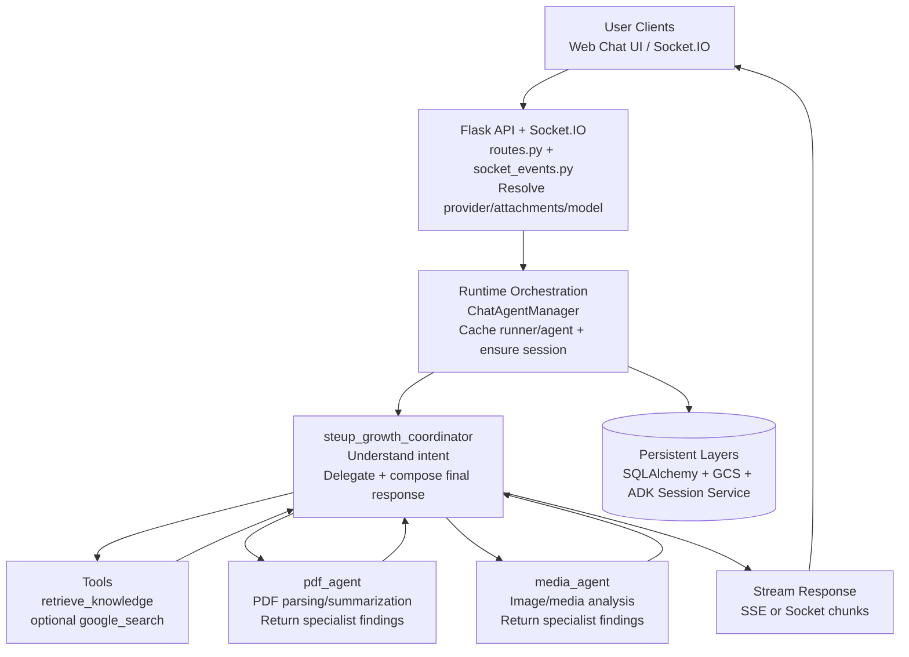

# Steup Growth Multi-Agent Chat System Architecture

## Overview

Steup Growth uses Google ADK to run a provider-aware, multi-agent chat system.
The runtime supports two backends:

- AI Studio mode (user-selected AI Studio key)
- Vertex AI mode (user-selected Vertex service account or Vertex API key)

The chat runtime keeps one coordinator agent as the user-facing entry point and delegates document or media analysis to specialist agents. It exposes two streaming surfaces: HTTP SSE and Socket.IO.

## Architecture Diagram (Agent-Level Task Flow)

```
┌──────────────────────────────────────────────────────────────────────────────┐
│                                USER CLIENTS                                 │
│                      Web Chat UI / Socket.IO Frontend                       │
└───────────────────────────────┬──────────────────────────────────────────────┘
                                │
                    HTTP POST /chat/stream  |  Socket send_message
                                │
┌───────────────────────────────▼──────────────────────────────────────────────┐
│                            FLASK API + SOCKET.IO                            │
│             app/routes.py (SSE) + app/socket_events.py (WS)                │
│  - resolve attachments/provider/model                                        │
│  - call generate_streaming_response(...)                                     │
│  - stream cleaned chunks to client                                           │
└───────────────────────────────┬──────────────────────────────────────────────┘
                                │
                                ▼
┌──────────────────────────────────────────────────────────────────────────────┐
│                 RUNTIME ORCHESTRATION (chat_agent.py)                       │
│  ChatAgentManager: cache runner/agent, ensure session, isolate provider      │
└───────────────────────────────┬──────────────────────────────────────────────┘
                                │
                                ▼
┌──────────────────────────────────────────────────────────────────────────────┐
│               steup_growth_coordinator (user-facing agent)                  │
│  Tasks:                                                                       │
│  - understand user intent                                                     │
│  - choose whether to delegate                                                 │
│  - call tools (retrieve_knowledge, optional google_search)                   │
│  - compose final conversational response                                      │
└───────────────┬───────────────────────────────┬──────────────────────────────┘
                │                               │
      delegates PDF tasks             delegates media tasks
                │                               │
                ▼                               ▼
┌──────────────────────────────┐     ┌────────────────────────────────────────┐
│ pdf_agent                    │     │ media_agent                            │
│ Tasks:                       │     │ Tasks:                                 │
│ - parse/read PDF context     │     │ - analyze image/media context          │
│ - summarize key information  │     │ - extract visual/textual cues          │
│ - return specialist findings │     │ - return specialist findings            │
└───────────────┬──────────────┘     └──────────────────────┬─────────────────┘
                │                                           │
                └─────────────── specialist results ────────┘
                                │
                                ▼
┌──────────────────────────────────────────────────────────────────────────────┐
│                         Coordinator final response                           │
│                 -> SSE / Socket chunk stream back to user                    │
└───────────────────────────────┬──────────────────────────────────────────────┘
                                │
                                ▼
┌──────────────────────────────────────────────────────────────────────────────┐
│                              PERSISTENT LAYERS                              │
│  SQLAlchemy: Users/Profiles/Keys/Conversations/Messages/FileUploads         │
│  GCS: uploaded files                                                         │
│  ADK Session Service: InMemorySessionService                                 │
└──────────────────────────────────────────────────────────────────────────────┘
```

## Mermaid Diagram (Agent-Level Task Flow)



## Runtime Modes and Provider Routing

### Mode A: AI Studio

- Credential source: selected `UserApiKey` where `provider = ai_studio`
- Primary execution: ADK multi-agent runner
- Video handling note: uploaded video attachments are not sent to AI Studio as video parts. The server first runs Vertex fallback transcription and injects transcript text into the coordinator prompt.

### Mode B: Vertex AI

- Credential source:
  - selected `VertexServiceAccount` (service account mode), or
  - selected `UserApiKey` where `provider = vertex_ai` (API key mode)
- Execution: ADK multi-agent runner configured through Vertex environment variables during request scope
- Isolation: Vertex requests use a distinct cache namespace (`{user_id}_vertex`) so AI Studio and Vertex runners are not mixed.

## Core Components

### 1. ChatAgentManager

File: `app/agent/chat_agent.py`

Responsibilities:

- Build coordinator + specialist hierarchy (`_create_agent`)
- Cache per-user/per-model agent and runner instances (`get_or_create_agent`, `get_or_create_runner`)
- Create stable session IDs tied to DB conversation IDs (`get_session_id`)
- Ensure sessions exist in ADK session service (`ensure_session_exists`, `ensure_session_exists_async`)

Session ID format:

- `conv_{user_id}_{conversation_id}` for persisted chat threads
- `temp_{user_id}` when conversation ID is not present

### 2. Coordinator Agent

Name: `steup_growth_coordinator`

Role:

- Main user-facing conversation agent
- Routes analysis work to `pdf_agent` and `media_agent`
- Integrates specialist outputs into final conversational responses
- Applies tool calls when needed (`retrieve_knowledge`, optional `google_search`)

Generation profile:

- Temperature `0.8`, top_p `0.95`

### 3. PDF Agent

Name: `pdf_agent`

Role:

- Analyze PDF content and return specialist output to coordinator

Generation profile:

- Temperature `0.2`, top_p `0.85`

### 4. Media Agent

Name: `media_agent`

Role:

- Analyze image and media content and return specialist output to coordinator

Generation profile:

- Temperature `0.55`, top_p `0.9`

## Agent Responsibility Matrix

The matrix below clarifies which tasks are owned by which runtime component.

| Component | Primary responsibilities | Trigger conditions | Expected output | Explicitly out of scope |
| --- | --- | --- | --- | --- |
| `steup_growth_coordinator` | user-facing conversation, intent interpretation, specialist delegation, tool invocation, final response composition | every user request enters coordinator path | conversational text streamed to user | low-level file parsing, direct storage operations |
| `pdf_agent` | PDF-oriented content understanding (document reading, summarization, key-point extraction) | request includes PDF attachment or PDF-focused question | specialist analysis returned to coordinator | direct user messaging, routing decisions, API/provider selection |
| `media_agent` | image/media understanding, visual context extraction, OCR-style observations where applicable | request includes image/media content; in AI Studio video path, uses transcript context prepared by runtime | specialist analysis returned to coordinator | direct user messaging, session/provider management |
| `ChatAgentManager` (runtime orchestrator, non-LLM agent) | agent/runner cache management, session creation, per-user model-key scoping | called by streaming wrapper before runner execution | ready-to-run ADK agent/runner/session context | semantic analysis or end-user response generation |

### Agent Boundaries and Hand-off Rules

1. User-visible output ownership belongs to coordinator only.
2. Specialists return analysis to coordinator and do not communicate with users directly.
3. File preparation and validation happens in runtime wrapper before specialist reasoning.
4. Provider routing (AI Studio vs Vertex) is resolved before agent execution and is not an agent concern.
5. Session lifecycle and cache invalidation are orchestration responsibilities, not specialist responsibilities.

### Task-to-Agent Mapping

| Task | Primary owner | Supporting owner(s) | Notes |
| --- | --- | --- | --- |
| Plain text conversation | `steup_growth_coordinator` | `ChatAgentManager` | coordinator handles intent and response style |
| RAG-backed knowledge answer | `steup_growth_coordinator` | `retrieve_knowledge` tool | coordinator decides when to call tool |
| PDF summarization | `pdf_agent` | `steup_growth_coordinator` | specialist analyzes; coordinator presents result |
| PDF key information extraction | `pdf_agent` | `steup_growth_coordinator` | includes structure/key-point understanding |
| Image description and visual reasoning | `media_agent` | `steup_growth_coordinator` | specialist handles visual analysis |
| OCR-like text observation from image/media | `media_agent` | `steup_growth_coordinator` | returned as specialist analysis |
| Video request in AI Studio mode | runtime fallback (`_transcribe_videos_with_vertex_fallback`) | `steup_growth_coordinator`, `media_agent` | runtime converts video into transcript context before coordinator response |
| Provider selection and credential mode resolution | route/socket layer | `ChatAgentManager` | not handled by specialist agents |
| Session creation and runner reuse | `ChatAgentManager` | ADK `InMemorySessionService` | runtime orchestration concern |
| Stream prefix cleanup and transport framing | route/socket layer | streaming wrapper | applies to SSE and Socket.IO outputs |

## Supported Inputs and Validation

File validation is enforced in `chat_agent.py`:

- Maximum file size: 500 MB
- Supported MIME categories:
  - PDF: `application/pdf`
  - Images: `image/jpeg`, `image/png`, `image/webp`, `image/heic`, `image/heif`
  - Videos: `video/mp4`, `video/mpeg`, `video/mov`, `video/quicktime`, `video/avi`, `video/x-msvideo`, `video/x-flv`, `video/mpg`, `video/webm`, `video/wmv`, `video/x-ms-wmv`, `video/3gpp`, `video/x-matroska`
- MIME fallback behavior: unknown but `video/*` types are accepted to remain browser/container tolerant.

## Attachment Payload Formats

`/chat/stream` supports both new and legacy payloads:

### New multi-file payload

- `file_urls`: JSON array of URLs
- `file_mime_types`: JSON array of MIME strings

### Legacy single-file payload

- `image_url` + `image_mime_type`, or
- multipart file `image`

Normalization and deduplication:

- `_normalize_file_attachments(...)` accepts dict/string entries, normalizes path + MIME, and deduplicates by path.

Follow-up file reuse:

- If no new files are provided and a conversation ID exists, the route inspects recent user messages (up to 30) and reuses the latest uploaded attachments.

## Chat Flows

### Flow 1: Text-only

```
User text -> Coordinator -> ADK stream -> SSE/Socket chunk stream -> Client
```

### Flow 2: PDF/Image with prompt

```
User message + attachment(s)
  -> attachment normalization + validation
  -> coordinator delegates specialist work as needed
  -> coordinator integrates specialist output
  -> chunked streaming response to client
```

### Flow 3: Video with AI Studio provider

```
User message + video attachment(s)
  -> detect video MIME
  -> server-side Vertex fallback transcription (_transcribe_videos_with_vertex_fallback)
  -> remove video binary parts from AI Studio request
  -> append transcript summary to text prompt
  -> coordinator responds using transcript + context
```

Fallback controls:

- `CHAT_VIDEO_VERTEX_FALLBACK` (default true)
- `CHAT_VIDEO_FALLBACK_TIMEOUT_SECONDS` (default 120)
- `CHAT_VIDEO_FALLBACK_MODEL` (default `gemini-3-flash-preview`)

### Flow 4: Vertex provider request

```
User request
  -> resolve vertex_config (service account or API key)
  -> configure env for Vertex scoped to request
  -> run ADK multi-agent streaming
  -> restore environment in finally block
```

## Streaming Implementation

### Shared entry point

- `generate_streaming_response(...)` is the sync wrapper used by both SSE and Socket.IO surfaces.

### Internal bridge model

- The sync wrapper starts a background thread.
- Inside that thread, `asyncio.run(...)` executes async ADK streaming.
- Chunks are pushed to a queue and consumed in the main sync generator.
- Main loop uses short queue timeouts and cooperative yielding to avoid blocking concurrent requests.

### Surface 1: HTTP SSE

File: `app/routes.py`

- Endpoint: `POST /chat/stream`
- Chunk post-processing:
  - `strip()`
  - remove prefixes: `Assistant:`, `AI:`, `Bot:`, `System:`, `Human:`
- Chunk framing:
  - JSON-encode each chunk, then emit as `data: <json>\n\n`

### Surface 2: Socket.IO

File: `app/socket_events.py`

- Event flow: `send_message` -> stream chunks via `ai_response_chunk`
- Uses the same prefix-stripping list before emit.

## Session Lifecycle

1. Conversation exists in SQL table.
2. Request resolves `session_id = conv_{user_id}_{conversation_id}`.
3. Session is created lazily in ADK `InMemorySessionService` if not already tracked.
4. Runner uses same session across subsequent messages in that conversation.
5. On conversation deletion, route-level cleanup can clear associated ADK session state.

## Error Handling and Recovery

### User-facing mapping

`_format_error_message(...)` maps internal errors to friendly responses for:

- unsupported region / precondition failures
- invalid API key / unauthorized
- quota and rate limit failures
- backend 5xx transient failures

### Stream safety

- If primary ADK stream fails, cached runner and agent entries for that key are removed to prevent stale state reuse.

### Vertex env safety

- Vertex mode snapshots and restores environment variables in a `finally` block.
- Temporary service-account files are removed after request completion.

## Data and Storage Layers

### SQLAlchemy models involved

- `User`, `UserProfile`
- `UserApiKey`, `VertexServiceAccount`
- `Conversation`, `Message`
- `FileUpload`

### GCS usage

- Upload helper: `gcp_bucket.upload_image_to_gcs(...)` and `upload_file_to_gcs(...)`
- Download helper: `gcp_bucket.download_file_from_gcs(...)`
- Storage key pattern: `{user_id}/{category}/{filename_timestamp.ext}`

## Security and Isolation

- JWT-protected routes for chat APIs.
- Per-user key ownership checks before provider execution.
- API keys and service-account credentials stored encrypted (Fernet) and decrypted only when needed.
- Provider-specific runner cache namespace separation to reduce cross-mode contamination.

## Design Principles (Current Implementation)

1. Single user-facing coordinator with specialist delegation.
2. Multi-provider runtime while preserving one streaming API shape.
3. Graceful degradation for unsupported media/provider combinations.
4. Request-scoped credential setup with cleanup.
5. Operational continuity via queue-based sync/async streaming bridge.

## Technology Stack

- Agent framework: Google ADK
- LLM runtime: Gemini models via AI Studio and Vertex AI
- Backend: Flask + Socket.IO
- Database: SQLAlchemy
- Storage: Google Cloud Storage
- Auth: JWT
- Encryption: Fernet for credential-at-rest protection

## Future Enhancements

1. Replace `InMemorySessionService` with durable distributed session storage.
2. Add observability for routing decisions, tool usage, and stream latency.
3. Expand specialist set with code-analysis and web-research specialists.
4. Add deterministic integration tests for provider matrix and fallback paths.
5. Introduce policy-based routing (model/provider) by task type.

## References

- `app/agent/chat_agent.py`
- `app/routes.py`
- `app/socket_events.py`
- `app/models.py`
- `app/gcp_bucket.py`
- `docs/VIDEO_ANALYSIS_AGENT_ARCHITECTURE.md`
- [Google ADK Documentation](https://github.com/google/adk-python)
- [Gemini Models Documentation](https://ai.google.dev/gemini-api/docs)