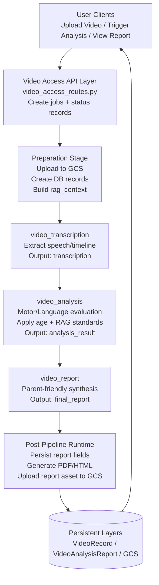

# Steup Growth Video Analysis Agent Architecture

## Overview

Steup Growth includes a dedicated video-analysis subsystem that is separate from the chat coordinator runtime.

The production path is a three-step ADK SequentialAgent pipeline:

1. Transcription
2. Developmental analysis (with RAG context)
3. Parent-facing report synthesis

The subsystem is orchestrated by API endpoints in `app/video_access_routes.py`, backed by SQLAlchemy models, GCS storage, and PDF report generation.

## Architecture Diagram (Agent-Level Task Flow)

```
┌──────────────────────────────────────────────────────────────────────────────┐
│                                USER CLIENTS                                 │
│                    Upload Video / Trigger Analysis / View Report            │
└───────────────────────────────┬──────────────────────────────────────────────┘
                                │
                                │ JWT-protected REST APIs
                                ▼
┌──────────────────────────────────────────────────────────────────────────────┐
│                      VIDEO ACCESS API LAYER (Flask)                         │
│                      app/video_access_routes.py                              │
│  - create background jobs and status records                                 │
│  - manage upload/analyze/report endpoints                                    │
└───────────────────────────────┬──────────────────────────────────────────────┘
                                │
                                ▼
┌──────────────────────────────────────────────────────────────────────────────┐
│           PREPARATION STAGE (non-agent orchestration runtime)               │
│  - upload to GCS                                                             │
│  - create VideoRecord / VideoAnalysisReport                                 │
│  - precompute rag_context for downstream agents                              │
└───────────────────────────────┬──────────────────────────────────────────────┘
                                │
                                ▼
┌──────────────────────────────┐
│ video_transcription          │
│ Tasks:                       │
│ - extract speech/timeline    │
│ - output normalized text     │
│ Output key: transcription    │
└───────────────┬──────────────┘
                │
                ▼
┌──────────────────────────────┐
│ video_analysis               │
│ Tasks:                       │
│ - assess motor/language      │
│ - apply age + RAG standards  │
│ Output key: analysis_result  │
└───────────────┬──────────────┘
                │
                ▼
┌──────────────────────────────┐
│ video_report                 │
│ Tasks:                       │
│ - synthesize parent report   │
│ - structure final payload    │
│ Output key: final_report     │
└───────────────┬──────────────┘
                │
                ▼
┌──────────────────────────────────────────────────────────────────────────────┐
│                   POST-PIPELINE RUNTIME (non-agent stage)                   │
│  - persist results to VideoAnalysisReport                                    │
│  - generate PDF/HTML via report_generator                                    │
│  - upload report asset to GCS                                                │
└───────────────────────────────┬──────────────────────────────────────────────┘
                                │
                                ▼
┌──────────────────────────────────────────────────────────────────────────────┐
│                            PERSISTENT LAYERS                                │
│  SQLAlchemy: VideoRecord, VideoAnalysisReport, VideoTimestamp               │
│  GCS: video assets + report assets                                           │
└──────────────────────────────────────────────────────────────────────────────┘
```

## Mermaid Diagram (Agent-Level Task Flow)



## End-to-End Processing Flows

### Flow 1: Upload and Background Transcription

```
POST /api/upload-video
  -> validate file presence, extension, size (500MB)
  -> upload to GCS (video_assess key)
  -> create VideoRecord (transcription_status=pending, analysis_status=pending)
  -> spawn daemon thread:
       transcription_status=processing
       call agent.generate_streaming_response(provider=vertex_ai)
       aggregate chunks into full_transcription
       set transcription_status=completed or failed
```

Implementation notes:

- The endpoint returns `201` immediately while transcription continues in background.
- Local development expects service account credentials from env files.
- Cloud Run can use attached service account credentials (ADC).

### Flow 2: Basic Transcript Analysis

```
POST /api/video/<video_id>/analyze
  -> requires transcription_status=completed and non-empty transcript
  -> spawn daemon thread:
       analysis_status=processing
       prompt model to return strict JSON (summary, key_points, suggestions, risks)
       parse JSON (fallback to raw text payload)
       save VideoRecord.analysis_report
       set analysis_status=completed or failed
```

This path is lightweight and writes to `VideoRecord` only.

### Flow 3: Full Child Development Analysis Pipeline

```
POST /api/video/<video_id>/child-analyze
  -> require child_id and user ownership checks
  -> create VideoAnalysisReport(status=pending)
  -> spawn daemon thread:
       status=processing
       call run_video_analysis(...)
       persist motor/language + optional behavioral/cognitive sections
       generate PDF/HTML report and upload to GCS
       status=completed, completed_at=timestamp
       on failure: status=failed, error_message=...
```

This path is the primary architecture for developmental assessment reporting.

## SequentialAgent Pipeline Design

File: `app/agent/video_analysis_agent.py`

The pipeline is assembled in `_create_video_pipeline(...)` and executed in `_run_pipeline_async(...)`.

Agent order:

1. `video_transcription`
2. `video_analysis`
3. `video_report`

Output keys written into ADK session state:

- `transcription`
- `analysis_result`
- `final_report`

Generation profiles:

- Transcription: temperature `0.1`, top_p `0.8`, max_output_tokens `32768`
- Analysis: temperature `0.3`, top_p `0.9`, max_output_tokens `65536`
- Report: temperature `0.6`, top_p `0.95`, max_output_tokens `32768`

Default pipeline model:

- `gemini-2.0-flash` (overrideable by function argument)
- Current route behavior: `/api/video/<video_id>/child-analyze` currently passes `gemini-3-flash-preview` into `run_video_analysis(...)`.

## Agent Responsibility Matrix

This pipeline uses fixed role separation so each agent has a single, clear responsibility.

| Agent | Primary responsibilities | Inputs it relies on | Output key | Explicitly out of scope |
| --- | --- | --- | --- | --- |
| `video_transcription` | extract speech/content timeline from video into structured transcription text | video bytes, child baseline prompt context | `transcription` | developmental judgement, intervention recommendations, final parent-facing synthesis |
| `video_analysis` | evaluate observed behavior against age context with motor/language focus and standards mapping | `transcription`, `child_info`, `rag_context` | `analysis_result` | final report formatting, PDF/report delivery |
| `video_report` | convert analysis into parent-friendly integrated report payload | `transcription`, `analysis_result`, `child_info` | `final_report` | raw media parsing, RAG retrieval, storage operations |

### Pipeline Hand-off Contracts

1. `video_transcription` must provide a usable transcription string for downstream reasoning.
2. `video_analysis` must produce machine-parseable analysis payloads suitable for persistence.
3. `video_report` must produce a report payload suitable for PDF/HTML rendering.
4. RAG retrieval is prepared before agent execution and injected via `rag_context`.
5. Persistence and status transitions are handled by route background workers, not by pipeline agents.

### Task-to-Agent Mapping

| Task | Primary owner | Supporting owner(s) | Notes |
| --- | --- | --- | --- |
| Speech/transcript extraction from uploaded video | `video_transcription` | route background worker | output persisted to transcription fields |
| Motor and language developmental evaluation | `video_analysis` | precomputed `rag_context` helpers | uses age-aware standards context |
| Standards-compliance structuring for downstream report | `video_analysis` | `_merge_report_with_analysis` | preserves analysis standards when report step omits them |
| Parent-facing report synthesis | `video_report` | route background worker | produces final report payload |
| RAG query and context assembly | `_collect_rag_context` helpers (runtime) | `assess_motor_development`, `assess_language_development` | executed before pipeline run |
| PDF/HTML report rendering and upload | `generate_and_upload_pdf` (runtime) | GCS utilities | non-agent post-processing stage |
| Status transition updates (`pending/processing/completed/failed`) | route background worker | SQLAlchemy models | non-agent orchestration concern |
| Report/video deletion cleanup | `video_cleanup` utilities | GCS delete helpers | non-agent lifecycle management |

## RAG Context Integration

RAG context is pre-computed before pipeline execution (`_collect_rag_context`).

Characteristics:

- Uses bilingual query sets (Chinese + English)
- Includes age-bracket standards (`0-6`, `6-12`, ..., `60-72` months)
- Builds references for motor and language dimensions
- Supplies context via initial ADK session state (`rag_context`)

Merge behavior:

- `_merge_report_with_analysis(...)` backfills standards data if the report-writing step omits standards sections that were present in analysis output.

## Retry and Resilience Strategy

`run_video_analysis(...)` wraps pipeline execution with retries.

Retry policy:

- Maximum attempts: 5
- Backoff formula: `wait_time = 10 * attempt_number`
- Retryable error markers include: `503`, `429`, `UNAVAILABLE`, `RESOURCE_EXHAUSTED`, `Socket closed`

If non-retryable or final attempt fails, the function returns `success=false` with an error message for persistence in report state.

## Status Model and Background Jobs

## VideoRecord status fields

- `transcription_status`: `pending -> processing -> completed/failed`
- `analysis_status`: `pending -> processing -> completed/failed`

## VideoAnalysisReport status field

- `status`: `pending -> processing -> completed/failed`
- `error_message`: populated on failure
- `completed_at`: set on success completion

Background execution model:

- Uses daemon threads started from Flask routes.
- Clients poll status endpoints to observe progress.

## Report Generation and Storage

File: `app/report_generator.py`

Pipeline output is rendered into HTML, then converted and uploaded:

1. Try WeasyPrint PDF generation
2. Fallback to xhtml2pdf
3. If both fail, upload HTML fallback

Storage details:

- Report key pattern uses `gcp_bucket.build_storage_key("reports", user_id, filename)`
- Output fields on `VideoAnalysisReport`:
  - `pdf_gcs_url`
  - `pdf_storage_key`

Download behavior:

- API endpoint returns direct bytes when available; otherwise signed URL / redirect fallback is used.

## Storage and Cleanup Lifecycle

File storage utilities:

- Upload/download/delete operations are implemented in `app/gcp_bucket.py`
- Signed URL generation is available for secure temporary access

Cleanup behavior:

- `app/video_cleanup.py` removes report assets and video assets from GCS
- Deleting a video can cascade into report cleanup and DB record deletion

## Security and Isolation

- All video/report endpoints are JWT-protected.
- Queries are scoped by `user_id` to enforce ownership boundaries.
- Vertex credentials are resolved from environment/service account context and used per request.
- Report/video access endpoints verify ownership before redirecting or streaming content.

## API Surface Summary

Key endpoints in `app/video_access_routes.py`:

- `POST /api/upload-video`
- `GET /api/videos`
- `GET /api/video/<video_id>`
- `DELETE /api/video/<video_id>`
- `POST /api/video/<video_id>/analyze`
- `POST /api/video/<video_id>/child-analyze`
- `GET /api/video-analysis-reports`
- `GET /api/video-analysis-report/<report_id>`
- `DELETE /api/video-analysis-report/<report_id>`
- `GET /api/video-analysis-report/<report_id>/download`
- `GET /api/video-file/<filename>` (auth-gated video redirect)
- `GET /api/videos/<video_id>/view` (signed URL preferred, direct stream fallback)

## Configuration and Constraints

- Max upload size: 500 MB
- Allowed video extensions controlled by `ALLOWED_VIDEO_EXTENSIONS`
- Vertex project/location must be available for server-side analysis/transcription
- GCS bucket must be configured (`GCS_BUCKET_NAME`)

## Design Principles (Current Implementation)

1. Asynchronous user experience via background workers and status polling.
2. Explicit, structured status transitions in DB for observability.
3. RAG-grounded analysis for age-appropriate interpretation.
4. Resilience through retry/backoff and report generation fallbacks.
5. Strong per-user isolation for data access and report retrieval.

## Future Enhancements

1. Replace daemon-thread execution with managed queue workers for horizontal scaling.
2. Add distributed job tracing and pipeline stage metrics.
3. Persist ADK session state in durable storage for long-running jobs.
4. Add stronger schema validation for intermediate/final agent JSON outputs.
5. Add idempotent job keys to prevent duplicate concurrent analysis jobs.

## References

- `app/video_access_routes.py`
- `app/agent/video_analysis_agent.py`
- `app/report_generator.py`
- `app/models.py`
- `app/video_cleanup.py`
- `app/gcp_bucket.py`
- `docs/MULTI_AGENT_SYSTEM_ARCHITECTURE.md`
- [Google ADK Documentation](https://github.com/google/adk-python)
- [Gemini Models Documentation](https://ai.google.dev/gemini-api/docs)
